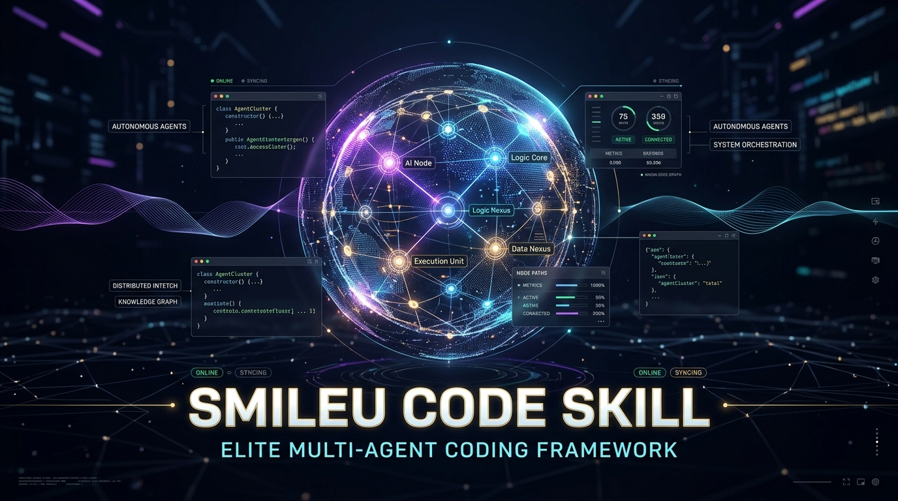

<div align="center">
  
</div>

# Smileu Code Skill

Smileu Code Skill adds a library of AI coding skills, agent personas and a `/smileu` command to your project, in the folders Claude Code, Cursor, Windsurf and Antigravity read. It also runs local checks for hardcoded secrets, UI anti-patterns and stock AI phrasing.

[](https://www.npmjs.com/package/smileu-code-skill)
[](https://nodejs.org/)
[](LICENSE)

## Contents

- [Requirements](#requirements)
- [Quick start](#quick-start)
- [npx or a global install](#npx-or-a-global-install)
- [Set up your editor](#set-up-your-editor)
- [What gets added to your project](#what-gets-added-to-your-project)
- [Using Smileu in your editor](#using-smileu-in-your-editor)
- [Agent personas](#agent-personas)
- [Command reference](#command-reference)
- [Keeping skills up to date](#keeping-skills-up-to-date)
- [Upgrading from version 1.1.1 or earlier](#upgrading-from-version-111-or-earlier)
- [Uninstalling](#uninstalling)
- [Troubleshooting](#troubleshooting)
- [Skill library](#skill-library)
- [Credits](#credits)
- [Security, changelog and license](#security-changelog-and-license)

## Requirements

- Node.js 18 or later.
- Claude Code, Cursor, Windsurf or Antigravity. Other AI tools that read `.agents/skills/` work too.
- Optional: Git, to install from the current library on GitHub with `--latest`.
- Optional: Graphify, for a more detailed `graph`. The `setup-tools` command installs it and needs Python or uv. Without Graphify, `graph` uses a built-in scanner.

## Quick start

1. Open a terminal in your project folder and run:

   ```bash
   npx smileu-code-skill init
   ```

2. Choose your editor and how much of the library to install.
3. Open the project in your editor. If it is already open, reload the window so the editor picks up the new files.
4. In the editor's chat, type:

   ```text
   /smileu
   ```

   The agent lists the phases. `/smileu secure`, for example, runs the security scan and fixes what it finds.

## npx or a global install

`npx smileu-code-skill` downloads the package into npm's cache and runs it for that one command. It does not add a `smileu` command to your system, so typing `smileu` afterwards fails with `command not found`.

| | Without installing | Global install |
|---|---|---|
| One-time setup | none | `npm install -g smileu-code-skill` |
| How to run a command | `npx smileu-code-skill <command>` | `smileu <command>` |
| Upgrade | `npx smileu-code-skill@latest <command>` | `npm install -g smileu-code-skill@latest` |

To install the `smileu` command:

```bash
npm install -g smileu-code-skill
```

```bash
smileu --version
```

Both forms accept the same commands and options. The examples in this README use `npx smileu-code-skill`; replace it with `smileu` if you installed globally.

The package is also published to GitHub Packages as `@nazalilis/smileu-code-skill-agents`. To install from there, add `@nazalilis:registry=https://npm.pkg.github.com` to your `.npmrc` and log in to that registry with a GitHub token that has the `read:packages` scope.

## Set up your editor

Run `init` with the name of your editor. Without a name, `init` installs for Claude Code, Cursor, Windsurf and Antigravity together.

| Editor | Install command | Use it in the editor |
|---|---|---|
| Claude Code | `npx smileu-code-skill init claude` | Type `/smileu <phase>`. Personas appear under `/agents`. |
| Cursor | `npx smileu-code-skill init cursor` | Type `/smileu <phase>` in Agent chat. Personas are available as subagents. |
| Windsurf | `npx smileu-code-skill init windsurf` | Type `/smileu <phase>` in Cascade. |
| Antigravity | `npx smileu-code-skill init antigravity` | Type `/smileu <phase>` in the agent chat. |
| Other agents that read `.agents/skills` | `npx smileu-code-skill init universal` | Ask the agent to use the `smileu` skill. |
| All four editors | `npx smileu-code-skill init -y` | As above, in each editor. |

### How much to install

| Choice | Command | Skills |
|---|---|---|
| Full library (default) | `npx smileu-code-skill init cursor` | all 890 |
| Core set | `npx smileu-code-skill init cursor --core` | 10: `smileu`, `smileu-code-skill` and the 8 skills listed under [Skill library](#skill-library) |
| Specific skills | `npx smileu-code-skill add domain-modeling tdd` | the ones you name, plus `smileu` and `smileu-code-skill` |
| Preview only | `npx smileu-code-skill init cursor --dry-run` | none; lists what would be written |

`add` copies skill folders only. It does not create personas, project documents, rule files or the Windsurf `/smileu` workflow. In a new project, run `init <editor> --core` first and use `add` for extra skills.

In a terminal, `init` without options asks which editor and scope you want. In CI and scripts there is nobody to answer, so pass an editor name, `--core` or `-y`.

Cursor also reads `.claude/skills/`. After an install for all editors, Cursor can therefore list each skill twice. If you only use Cursor, install with `init cursor`.

## What gets added to your project

An install for all editors adds the following. An install for one editor adds only the parts marked for it in the table below.

```text
your-project/
├── .claude/
│   ├── skills/                  Claude Code skills, one folder per skill
│   └── agents/                  12 personas for Claude Code
├── .agents/
│   ├── skills/                  the same skills for Cursor, Windsurf, Antigravity and other agents
│   └── rules/smileu.md          Antigravity project rules
├── .cursor/
│   ├── rules/smileu.mdc         Cursor project rules, always applied
│   └── agents/                  12 personas for Cursor
├── .windsurf/
│   ├── rules/smileu.md          Windsurf project rules, always on
│   └── workflows/smileu.md      the /smileu command in Windsurf
├── .smileu/                     install record, reports, graph, task plans and backups
├── docs/adr/0001-unified-vibe-coding-harness.md
├── .gitignore                   gets a .smileu/ entry
├── AGENTS.md
├── CLAUDE.md
├── CONTEXT.md
├── DESIGN.md
└── PRODUCT.md
```

| Path | Written for | Purpose |
|---|---|---|
| `.claude/skills/` | Claude Code | Skill folders. Claude Code loads a skill when your request matches its description. |
| `.agents/skills/` | Cursor, Windsurf, Antigravity, other agents | The same skill folders, in the location these tools share. |
| `.claude/skills/smileu/`, `.agents/skills/smileu/` | every editor | The `/smileu` command. |
| `.claude/skills/smileu-code-skill/`, `.agents/skills/smileu-code-skill/` | every editor | The main guidelines: the six phases and the rules for design, security and writing. |
| `.claude/agents/` | Claude Code | Persona files, loaded as subagents. |
| `.cursor/agents/` | Cursor | Persona files, loaded as subagents. |
| `CLAUDE.md` | Claude Code | Project instructions Claude Code reads at the start of each session. It imports `AGENTS.md`. |
| `.cursor/rules/smileu.mdc` | Cursor | Project rules applied to every Agent request. |
| `.windsurf/rules/smileu.md` | Windsurf | Project rules applied to every Cascade request. |
| `.windsurf/workflows/smileu.md` | Windsurf | Makes `/smileu` available in Cascade. |
| `.agents/rules/smileu.md` | Antigravity | Project rules for the Antigravity agent. |
| `AGENTS.md` | every editor | Agent roles and the order of the six phases. Cursor and Windsurf read it directly. |
| `PRODUCT.md` | every editor | Audience, purpose, constraints and voice of the project. Fill it in, or use `/smileu align`. |
| `CONTEXT.md` | every editor | Domain terms and rules that must not be broken. |
| `DESIGN.md` | every editor | Design system notes: type, color, spacing and motion. |
| `docs/adr/0001-unified-vibe-coding-harness.md` | every editor | A first architecture decision record, as an example for your own. |
| `.gitignore` | every editor | `init` adds a `.smileu/` entry, and creates the file if there is none. |
| `.smileu/` | created by `init` | The install record and the output of the checks. See the table below. |

### What happens when you run init again

- Project documents, rule files and the Windsurf workflow are created only when they are missing, so your edits to them are kept.
- Persona files that already exist are kept unless you pass `--force`. Persona files you deleted are added back.
- Skill files are copied again from the library, so edits you made inside a skill folder are replaced. Files you added to a skill folder stay.

### The .smileu folder

| Path | Created by |
|---|---|
| `.smileu/manifest.json` | `init`, `add` and `update`: which skills and editors are installed |
| `.smileu/reports/SECURITY_AUDIT.md` | `audit`, `/smileu secure` |
| `.smileu/reports/DESIGN_AUDIT.md` | `craft`, `/smileu craft` |
| `.smileu/reports/HUMANIZER_AUDIT.md` | `humanize`, `/smileu humanize` |
| `.smileu/graph/` | `graph`, `/smileu graph` |
| `.smileu/tasks/task-*.md` | `swarm`, `/smileu swarm` |
| `.smileu/backups/` | `grill`, before it replaces `PRODUCT.md` or `CONTEXT.md` |

### What to commit

Commit the editor folders and project documents when everyone on the team should work with the same skills and rules. If each developer installs Smileu separately, add `.claude/skills/` and `.agents/skills/` to `.gitignore` instead. Keep `.smileu/` out of version control; `init` already ignores it.

## Using Smileu in your editor

| Type in the chat | What the agent does |
|---|---|
| `/smileu` | Lists the phases and asks which one to run. |
| `/smileu align` | Asks two or three questions about unclear requirements, then updates `PRODUCT.md` and `CONTEXT.md`. |
| `/smileu graph` | Maps the project's files and imports and names the files the current work touches. |
| `/smileu swarm add password reset` | Writes a five-role plan to `.smileu/tasks/` and works through it. |
| `/smileu craft` | Runs the design scan and fixes each finding. |
| `/smileu polish` | Reviews spacing, type, contrast and motion in the files you changed. |
| `/smileu secure` | Runs the security scan, fixes the findings and runs it again until it passes. |
| `/smileu humanize` | Rewrites stock AI phrasing in Markdown files. |
| `/smileu motion enter` | Applies an easing preset (`enter`, `exit`, `hover` or `modal`). |
| `/smileu all` | Runs every check, then works through the reports in order. |
| `/smileu update` | Refreshes the installed skills. |
| `/smileu doctor` | Reports which optional tools are missing. |

When a phase needs a check, the agent runs the CLI in the editor's terminal. It uses `smileu` when it is installed globally and `npx --yes smileu-code-skill` otherwise. The editor's terminal therefore needs Node.js, and npx needs network access the first time it runs.

Skills also work without the command. When you ask for a UI component, a security review or a README, the agent loads the skill whose description matches. You can also name one, for example "use the frontend-taste skill for this page".

## Agent personas

Claude Code and Cursor load these personas as subagents. Ask for one by name, for example "use the guardian subagent to review this change". Windsurf and Antigravity have no persona files; the same roles are described in `AGENTS.md`.

| Persona | Use it for |
|---|---|
| `architect` | Changes to module boundaries, schemas or interfaces; architecture decision records. |
| `engineer` | Implementing logic, API handlers and components once the design is agreed. |
| `craft` | UI components, layout, styling and animation. |
| `guardian` | Reviewing input handling, authentication, secrets, shell commands and dependencies. |
| `editor` | Documentation, README files, commit messages and pull request descriptions. |
| `orchestrator` | Splitting a large request into tasks for the other personas. |
| `sparc-coder` | Self-contained logic units. |
| `tester` | Unit, regression and integration tests. |
| `impeccable-asset-producer` | Reusable image assets cut from approved Impeccable mockups. |
| `impeccable-documenter` | Writing `DESIGN.md` from a finished Impeccable build. |
| `impeccable-finish-reviewer` | A final review of alignment, rhythm and type scale. |
| `impeccable-manual-edit-applier` | Applying copy edits made in Impeccable's live mode to the source. |

## Command reference

| Command | What it does | Exit code |
|---|---|---|
| `init [editor]` | Install skills, personas, project documents and editor files. The default command. | 1 if anything failed |
| `add <skill...>` | Install skills by name. Names must match exactly; `list --all` shows them. | 1 if a skill was not found |
| `update` | Refresh installed skills and personas. | 1 if nothing is installed, `--check` cannot reach npm or GitHub, or an old copy could not be removed |
| `audit` | Scan for hardcoded secrets, `eval()`, `new Function()` and unsafe shell commands, and run `npm audit`. See below. | 1 on critical or high findings |
| `craft` | Flag pure `#000` black, `bounce` or `elastic` easing and nested `card` classes in CSS, HTML, JSX, TSX, Vue and Svelte files. | 0 |
| `humanize` | Flag common stock AI phrases in Markdown files. | 0 |
| `graph` | Build a file and import graph of the project. | 0 |
| `run-all` | Create missing project documents, then run `graph`, `craft`, `audit` and `humanize`. | 1 if a step failed or `audit` found critical or high findings |
| `grill` | Ask 5 questions in the terminal and write `PRODUCT.md` and `CONTEXT.md`. Answers can be piped in, one per line. | 2 if input ends early |
| `swarm "<task>"` | Save a checklist for five roles to `.smileu/tasks/`. | 2 without a task |
| `motion [preset]` | Print CSS, Tailwind and Framer Motion easing for `enter`, `exit`, `hover` or `modal`. | 2 for an unknown preset |
| `doctor` | Show which of Node.js, Git, Python, uv and Graphify are available. | 0 |
| `setup-tools` | Install Graphify with uv, or with pip when uv is missing. | 1 if the install failed |
| `list [--all] [filter]` | List the core skills, or every skill name that contains the filter. | 1 if nothing matches |
| `repos` | List the open-source projects the library draws on. | 0 |

Aliases: `install` for `init`, `align` for `grill`, `secure` for `audit`, `polish` for `craft`, `pipeline` for `run-all`.

### What audit checks

`audit` reads JavaScript, TypeScript, JSON, YAML and TOML files, `.env` files, `.npmrc` and `.pypirc`, and looks for credential patterns such as API keys, tokens and private keys. In JavaScript and TypeScript files it also flags `eval()`, `new Function()`, child process calls with a `shell` option and commands built from strings. When the project has a `package.json`, it runs `npm audit`.

It is a pattern scan, not a full OWASP Top 10 review, and it does not read other languages such as Python or Go. It skips folders named `test`, `tests`, `__tests__`, `__mocks__`, `fixtures`, `node_modules`, `dist`, `build`, `coverage`, `vendor` and `skills`, and every folder whose name starts with a dot except `.github`. Reports name the file and the kind of secret, never the secret itself.

### Options for init and add

| Option | Effect |
|---|---|
| `-e, --editor <name>` | `claude`, `cursor`, `windsurf`, `antigravity`, `universal` or `all`. Same as `init <name>`. |
| `--core` | Install the core set instead of the full library. |
| `--latest` | Install from the current library on GitHub instead of the copy in the package. Needs Git and network access; if the download fails, the bundled copy is used and a warning is printed. |
| `--force` | Replace persona files that already exist. |
| `--dry-run` | Show what would be written without writing anything. |
| `-y, --yes` | Skip the questions and use the defaults. |

### Options for update

| Option | Effect |
|---|---|
| `-e, --editor <name>` | Update only that editor's folders. |
| `--latest` | Update from the current library on GitHub. |
| `--include-new` | Also install every library skill the project does not have yet. On a core install, this adds the rest of the library. |
| `--remove-old-layout` | Remove copies that versions 1.1.1 and earlier left in `.cursor/rules/`, `.agent/` and `.skills/`. |
| `--check` | Report whether a newer release exists. Changes nothing. |
| `--dry-run` | Show what would change without writing anything. |

### Global options and output

| Option | Effect |
|---|---|
| `-h, --help` | Print the help. |
| `-v, --version` | Print the version. |
| `--no-color` | Turn off color. The `NO_COLOR` environment variable does the same. |

Exit code 0 means success, 1 means the command failed or found a blocking problem, and 2 means the command was used incorrectly. Warnings and errors are printed to stderr. Because `audit` exits 1 on critical or high findings, you can use it to fail a CI job.

## Keeping skills up to date

| Goal | Command |
|---|---|
| Refresh installed skills and personas | `npx smileu-code-skill update` |
| Refresh from the current library on GitHub | `npx smileu-code-skill update --latest` |
| Add every library skill the project does not have yet | `npx smileu-code-skill update --include-new` |
| Preview the changes | `npx smileu-code-skill update --dry-run` |
| Check for a newer release of the CLI | `npx smileu-code-skill update --check` |

`update` rewrites every installed skill file and persona file that differs from the library, so your edits to those files are replaced; run it with `--dry-run` first if you changed them. Persona files you deleted stay deleted, and with `--editor` only that editor's folders are written. Files you added inside a skill folder are kept, and project documents and rule files are not touched.

## Upgrading from version 1.1.1 or earlier

Earlier versions put skills in folders that Cursor and Windsurf do not read, and did not install the `/smileu` command. To move a project to the current layout, install for your editor and then remove the old copies:

```bash
npx smileu-code-skill@latest init cursor
```

```bash
npx smileu-code-skill@latest update --remove-old-layout
```

| Old location | New location |
|---|---|
| `.cursor/rules/<skill>/` | `.agents/skills/<skill>/` |
| `.agent/skills/` | `.agents/skills/` |
| `.skills/` | `.agents/skills/` |
| `.agent/agents/`, `.skills/agents/` | none: Windsurf, Antigravity and other agents no longer get persona files |
| `.cursorrules` | `.cursor/rules/smileu.mdc` |
| `.windsurfrules` | `.windsurf/rules/smileu.md` |

`--remove-old-layout` removes only skill folders and persona files whose content identifies them as Smileu copies, then deletes old folders that are left empty. A file or folder that merely shares its name with a Smileu skill or persona is kept and listed, and your own rules and skills in those folders stay. Add `--dry-run` to see how many copies it would remove from each folder, and `--editor <name>` to check only that editor's old folders. `.cursorrules` and `.windsurfrules` are never deleted, because many teams edit them; remove them yourself if they contain only the old Smileu rules.

Projects installed only for Claude Code already use the right folders. Run `npx smileu-code-skill@latest init claude` once to add the `/smileu` command.

## Uninstalling

`.smileu/manifest.json` lists every skill Smileu installed; read it before you delete `.smileu/`. Check whether a folder also holds your own files before you delete it.

| What | Where |
|---|---|
| Skills | the skill folders in `.claude/skills/` and `.agents/skills/` |
| Personas | the 12 persona files in `.claude/agents/` and `.cursor/agents/` |
| Editor files | `.cursor/rules/smileu.mdc`, `.windsurf/rules/smileu.md`, `.windsurf/workflows/smileu.md`, `.agents/rules/smileu.md` |
| Output | the `.smileu/` folder, and the `.smileu/` entry with its comment line in `.gitignore` |
| Project documents | `PRODUCT.md`, `CONTEXT.md`, `DESIGN.md`, `AGENTS.md`, `CLAUDE.md` and `docs/adr/0001-unified-vibe-coding-harness.md`, if you did not make them your own |

If you installed the command globally:

```bash
npm uninstall -g smileu-code-skill
```

## Troubleshooting

### `smileu: command not found`

`npx smileu-code-skill` does not install the `smileu` command. Either keep using `npx smileu-code-skill <command>`, or install it with `npm install -g smileu-code-skill`.

If `smileu` is still not found after a global install, npm's global folder is not on your `PATH`. Run `npm prefix -g`: on Windows add that folder to `PATH`, on macOS and Linux add its `bin` subfolder. Then open a new terminal.

### `/smileu` does not appear in the editor

1. Reload the editor window, or restart the editor.
2. Check that the install was for this editor. Claude Code needs `.claude/skills/smileu/`. Cursor and Antigravity need `.agents/skills/smileu/`. Windsurf needs `.windsurf/workflows/smileu.md` and `.agents/skills/smileu/`. If something is missing, run `init` with the editor's name.
3. Make sure the project folder you opened is the one you installed into.
4. Update the editor. Skill and command support requires a recent version.

### Skills do not load in Cursor or Windsurf after an earlier install

Versions 1.1.1 and earlier used folders these editors do not read. See [Upgrading from version 1.1.1 or earlier](#upgrading-from-version-111-or-earlier).

### Some security skills are missing

A few security skills contain detection rules and sample commands for malware analysis, and antivirus software such as Microsoft Defender can quarantine those files.

- If the antivirus removed a skill's `SKILL.md` from the downloaded package, the install skips that skill without a message, and `list` counts fewer than 890 skills.
- If it blocks a file during the copy, the install names the skill that failed.

Restore the files from quarantine or allow them in your antivirus, then run `npx smileu-code-skill add <skill-name>`, or skip those skills if you do not need them.

### `init` stops with "No install scope given and no terminal to ask"

`init` was started without a terminal, as happens in CI. Pass an editor name, `--core` or `-y`, for example `npx smileu-code-skill init claude --core`.

### npx asks "Need to install the following packages ... Ok to proceed?"

Answer `y`, or run `npx --yes smileu-code-skill <command>` to skip the question.

### `graph` says it uses the built-in scanner

Graphify is not installed. Run `npx smileu-code-skill doctor` to see what is missing, and `npx smileu-code-skill setup-tools` to install Graphify, which needs Python or uv. The built-in scanner reads JavaScript, TypeScript, JSON and Markdown files and lists the import paths each one uses.

## Skill library

The library holds 890 skills. `npx smileu-code-skill list --all` prints every name, and `list --all <word>` filters them, for example `list --all docker`.

Every install includes these two skills:

| Skill | Purpose |
|---|---|
| `smileu` | The `/smileu` command. |
| `smileu-code-skill` | The main guidelines: the six phases and the rules for design, security and writing. |

The core set (`--core`) adds:

| Skill | Covers |
|---|---|
| `engineering-alignment` | Clarifying questions, the domain dictionary and architecture decision records. |
| `codebase-knowledge-graph` | Reading the project's structure and spotting oversized modules. |
| `frontend-taste` | Typography, color and layout without generic AI templates. |
| `design-craft-impeccable` | Design craft, `PRODUCT.md` and `DESIGN.md`. |
| `motion-physics` | Easing curves, spring motion and interaction timing. |
| `agent-orchestration` | Splitting work across roles with the SPARC workflow. |
| `humanizer-writing` | Plain writing without stock AI phrasing. |
| `cybersecurity-hardening` | OWASP Top 10 defenses, input validation and secret handling. |

Most of the rest of the full library is security skills (818 of them), covering areas such as threat hunting, incident response, cloud and container security, malware analysis and compliance.

## Credits

The library draws on these open-source projects. `npx smileu-code-skill repos` prints the same list.

| Project | Author | Used for |
|---|---|---|
| [mattpocock/skills](https://github.com/mattpocock/skills) | Matt Pocock | Grilling sessions, `CONTEXT.md`, architecture decision records, TDD |
| [Graphify-Labs/graphify](https://github.com/Graphify-Labs/graphify) | Graphify Labs | Codebase graphs |
| [Leonxlnx/taste-skill](https://github.com/Leonxlnx/taste-skill) | Leonxlnx | Frontend taste: type scales, spacing grids, color |
| [ruvnet/ruflo](https://github.com/ruvnet/ruflo) | rUv | Multi-agent roles and the SPARC workflow |
| [pbakaus/impeccable](https://github.com/pbakaus/impeccable) | Paul Bakaus | `PRODUCT.md`, `DESIGN.md` and design craft |
| [emilkowalski/skills](https://github.com/emilkowalski/skills) | Emil Kowalski | Motion timing and easing |
| [blader/humanizer](https://github.com/blader/humanizer) | Blader | Writing patterns to avoid |
| [mukul975/Anthropic-Cybersecurity-Skills](https://github.com/mukul975/Anthropic-Cybersecurity-Skills) | Mukul | Security skills |

## Security, changelog and license

- Report vulnerabilities as described in [SECURITY.md](SECURITY.md).
- Changes in each release are listed in [CHANGELOG.md](CHANGELOG.md) and on the [Releases page](https://github.com/nazalilis/smileu-code-skill-agents/releases).
- MIT License © 2026 Smileu. See [LICENSE](LICENSE).
